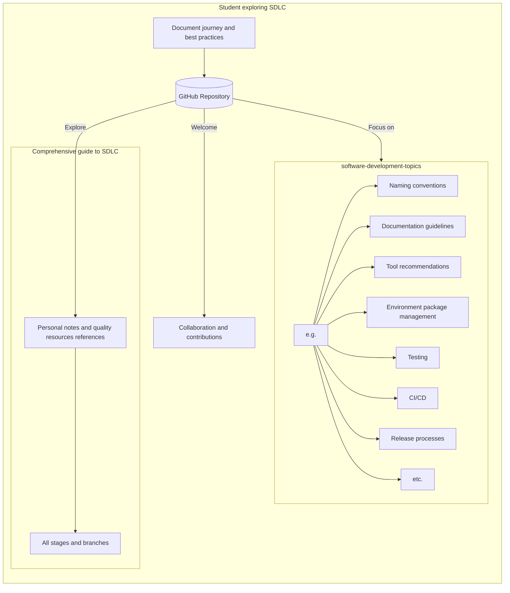

<!-- Header block for project -->

<!-- ☝️ Replace with your logo (if applicable) via  ☝️ -->
<!-- ☝️ If you see logo rendering errors, make sure you're not using indentation, or try an HTML IMG tag -->
<h1 align="center">SDLC Journey</h1>

<!-- ☝️ Replace with your repo name ☝️ -->

<pre align="center">Documenting my journey as a student exploring the software development life cycle (SDLC) and creating a comprehensive guide to best practices in software development.</pre>

<!-- ☝️ Replace with a single sentence describing the purpose of your repo / proj ☝️ -->

<!-- Header block for project -->

<!-- ☝️ Add badges via: https://shields.io e.g.  ☝️ -->

<!-- ☝️ Screenshot of your software (if applicable) via  ☝️ -->

As a student exploring the software development life cycle (SDLC), I am documenting my journey and the best practices I discover along the way. This repository includes my personal experiences and references to quality resources, with a focus on a wide range of topics related to software development such as naming conventions, commit message standards, documentation guidelines, tool recommendations, environment package management, testing, continuous integration/continuous deployment, and release processes. My goal is to create a comprehensive guide to the SDLC, covering all stages and branches. Please note that my knowledge and understanding are still developing, and I welcome collaboration and contributions from others.
<!-- ☝️ Replace with a more detailed description of your repository, including why it was made and whom its intended for.  ☝️ -->

## Features

* Organize information in a structural and consise way
  * Mermaid graphs are used a lot
* Provide references to quality resources

<!-- ☝️ Replace with a bullet-point list of your features ☝️ -->

## Contents

* [Quick Start (NOT DONE)](#quick-start)
* [Changelog (NOT DONE)](#changelog)
* [FAQ (NOT DONE)](#frequently-asked-questions-faq)
* [Contributing Guide (NOT DONE)](#contributing)
* [License](#license)
* [Support](#support)

## Quick Start (NOT DONE)

This guide provides a quick way to get started with our project. Please see our [docs (NONE DONE YET)]([INSERT LINK TO DOCS SITE / WIKI HERE]) for a more comprehensive overview.

### Requirements (NOT DONE)

* [INSERT LIST OF REQUIREMENTS HERE]

<!-- ☝️ Replace with a numbered list of your requirements, including hardware if applicable ☝️ -->

### Usage Examples (NOT DONE)

* [INSERT LIST OF COMMON USAGE EXAMPLES HERE, WITH OPTIONAL SCREENSHOTS]

<!-- ☝️ Replace with a list of your usage examples, including screenshots if possible, and link to external documentation for details ☝️ -->

## Changelog (NOT DONE)

See our [CHANGELOG.md](CHANGELOG.md) for a history of our changes.

See our [releases page (NOT DONE)]([INSERT LINK TO YOUR RELEASES PAGE]) for our key versioned releases.

<!-- ☝️ Replace with links to your changelog and releases page ☝️ -->

## Frequently Asked Questions (FAQ) (NOT DONE)

[INSERT LINK TO FAQ PAGE OR PROVIDE FAQ INLINE HERE]
<!-- example link to FAQ PAGE>
Questions about our project? Please see our: [FAQ]([INSERT LINK TO FAQ / DISCUSSION BOARD])
-->

<!-- example FAQ inline format>
1. Question 1
   - Answer to question 1
2. Question 2
   - Answer to question 2
   -->

<!-- example FAQ inline with no questions yet>
No questions yet. Propose a question to be added here by reaching out to our contributors! See support section below.
-->

<!-- ☝️ Replace with a list of frequently asked questions from your project, or post a link to your FAQ on a discussion board ☝️ -->

## Contributing (NOT DONE)

[INSERT LINK TO CONTRIBUTING GUIDE OR FILL INLINE HERE]
<!-- example link to CONTRIBUTING.md>
Interested in contributing to our project? Please see our: [CONTRIBUTING.md](CONTRIBUTING.md)
-->

<!-- example inline contributing guide>
1. Create an GitHub issue ticket describing what changes you need (e.g. issue-1)
2. [Fork](INSERT LINK TO YOUR REPO FORK PAGE HERE, e.g. https://github.com/my_org/my_repo/fork) this repo
3. Make your modifications in your own fork
4. Make a pull-request in this repo with the code in your fork and tag the repo owner / largest contributor as a reviewer

**Working on your first pull request?** See guide: [How to Contribute to an Open Source Project on GitHub](https://kcd.im/pull-request)
-->

[INSERT LINK TO YOUR CODE_OF_CONDUCT.md OR SHARE TEXT HERE]
<!-- example link to CODE_OF_CONDUCT.md>
For guidance on how to interact with our team, please see our code of conduct located at: [CODE_OF_CONDUCT.md](CODE_OF_CONDUCT.md)
-->

<!-- ☝️ Replace with a text describing how people may contribute to your project, or link to your contribution guide directly ☝️ -->

## License

See our: [LICENSE](https://github.com/perryzjc/sdlc-journey/blob/main/LICENSE)
<!-- ☝️ Replace with the text of your copyright and license, or directly link to your license file ☝️ -->

## Support

[@perryzjc](https://github.com/perryzjc)

<!-- example list of contacts>
Key points of contact are: [@github-user-1](link to github profile) [@github-user-2](link to github profile)
-->

<!-- ☝️ Replace with the key individuals who should be contacted for questions ☝️ -->
